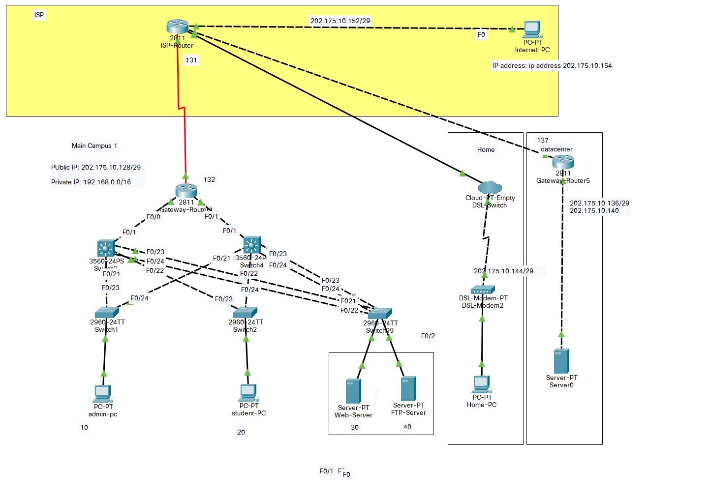

# **WAN Technology**

-----

>  Author:
>
>  [@Hongbo Wang ](https://github.com/BOBWang1117)
>
>  

## **Environment:**

- [Cisco Packet Tracer 8.0.1.0064](https://itexamanswers.net/cisco-packet-tracer-8.html)

  

## **Details**

- Type: term project

- Teacher: 李险峰

- Computer Language: Cisco

- Project Name: WAN Technology

- Time: 2020/12/31

- Description: There are four separate networks (ISP access network, main campus, data center, home) connected by WAN technology, mapping the topology, including routers, switches, DSL modems, etc. Configure VLAN, NAT service, access control as needed

## **Dependencies:** 

- None

## **Install package:**

- https://itexamanswers.net/cisco-packet-tracer-8.html

## **Run program:**

- If open the *.pkt is an invalid file 
  (The file *.pkt is not compatible with this version of Packet Tracer):

  1. Please check your Cisco version.

  2. If the version is lower than 8.0.1, please download the application and upper URL may help you.

     

- If open the *.pkt is an empty file:

  1. Open Cisco Packet Tracer 8.0.1
  2. Find 'File' button and click 'open...', then find this file.
     This could be solve the probelm!

  

  

 

## **Example:**

1. 

   

